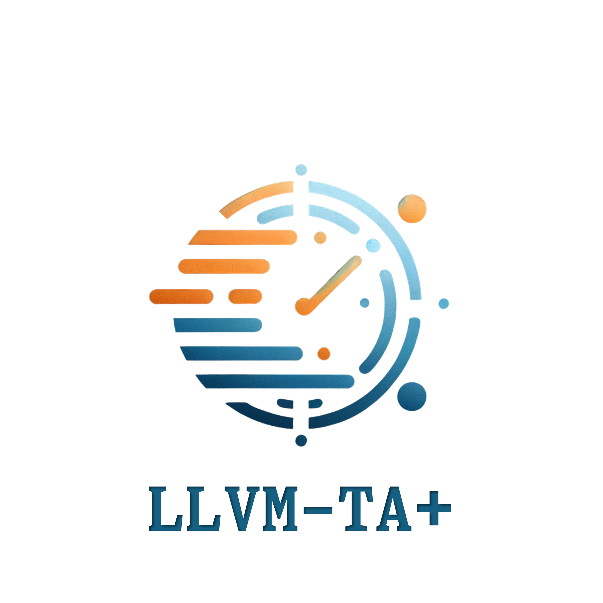

# Worst-Case Execution Time Analysis for Multicore Real-time Systems

    </>

    
    
    

    <a href="README.md">English</a> | <a href="README_zh.md">中文</a>

[LLVM-TA+](https://github.com/RTS-SYSU/LLVM-TA-) is a static analysis tool for WCET(Worst Case Execution Time) of real-time systems based on LLVM.

## Design Goal

Our goal is to provide a static analysis tool for WCET of real-time systems based on LLVM, which can effectively analyze the WCET of systems and tighten the WCET upper bound.

To achieve this, we combine the existing LLVM-TA with the analysis method, and further improve the analysis accuracy and efficiency. The whole process can be divided into the following steps:

1. Value Analysis: Analyze the data of registers and memory at each position of the program, and use it as the input of the subsequent processor behavior analysis.
2. Control Flow Analysis: Analyze the control flow of the program to obtain the constraint conditions of the possible execution paths of the program, such as the number of iterations of the loop, etc. LLVM-TA+ uses source code-based control flow analysis, that is, analyzing the control flow of the program through the SSA representation of LLVM(LLVM-IR).
3. Processor Behavior Analysis: Through control flow analysis, we can get multiple possible execution paths of the program, and processor behavior analysis is to analyze the execution situation of these paths on the processor, such as the cache hit situation, etc., and calculate the execution time limit of the basic block in the path.
4. Bound Calculation: Based on the results of control flow analysis and processor behavior analysis, we can get the bound of the program on a specific execution path, and then calculate the WCET of the program.

## Scripts

For easy evaluation of this project, we provide some scripts to help evaluate the project. The scripts are located in the `scripts` directory, and the usage of each script can be found in the [README](scripts/README.md) file.

## Installation

For installation of the project, please refer to the [installation document](docs/INSTALL.md).

## Usage

For the usage of the project, please refer to the [usage document](docs/USAGE.md).

# Acknowledgement

1. [LLVMTA](https://gitlab.cs.uni-saarland.de/reineke/llvmta)
2. [TACLeBench](https://github.com/tacle/tacle-bench)
